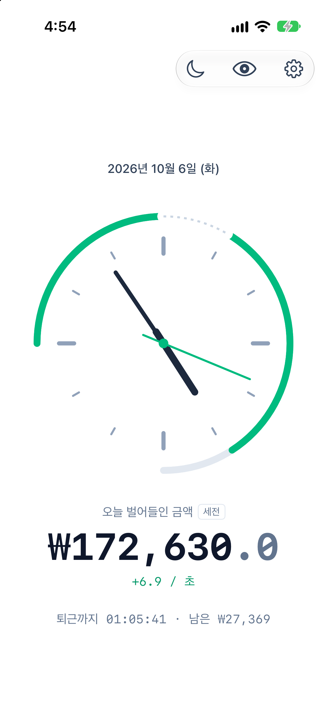
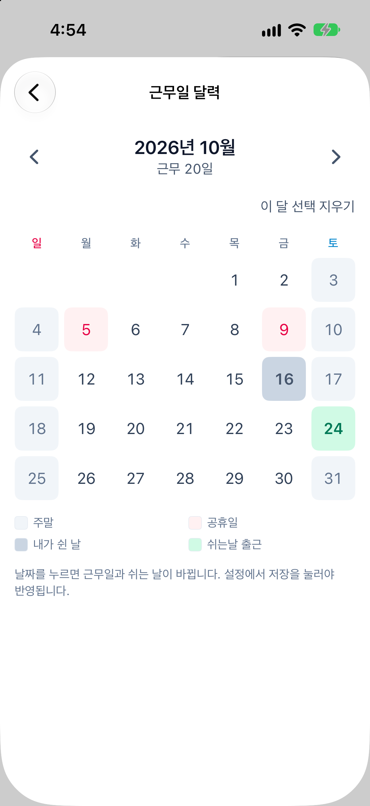
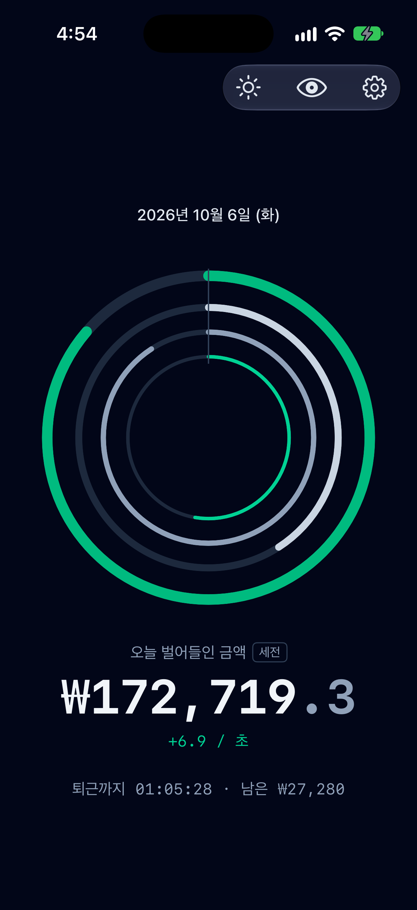
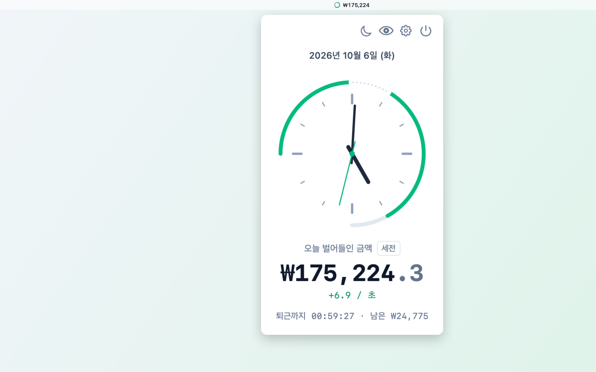

# SalaryClock

**출근부터 퇴근까지, 오늘 번 돈이 초 단위로 올라갑니다.**

연봉·월급·시급 중 하나와 근무 시간만 넣으면 출근 시각부터 금액이 올라가기 시작합니다.
점심시간에는 멈추고, 퇴근하면 오늘 번 금액이 그대로 남습니다.

웹에서 바로 쓰기: **https://sc.vicals.com**

  
  
  

## 어디서 쓸 수 있나요

| | 요구 사항 | 받는 곳 |
|---|---|---|
| iPhone | iOS 17 이상 | [App Store](https://apps.apple.com/kr/app/id6819583975) |
| Mac (메뉴바) | macOS 14 이상 | [Mac App Store](https://apps.apple.com/kr/app/id6819583975?platform=mac) |
| 웹 | 최신 브라우저 | [sc.vicals.com](https://sc.vicals.com) |

모두 무료이고, 회원가입과 광고가 없습니다. App Store에서 한 번 받으면 iPhone과 Mac
모두에서 쓸 수 있습니다.

## 이런 걸 보여줍니다

- **오늘 번 금액** — 1초마다 올라갑니다. 1초에 얼마씩 버는지, 퇴근까지 남은 시간과
  금액도 함께 보입니다.
- **지금 상태** — 출근 전·근무 중·점심시간·퇴근 후·쉬는 날을 알아서 구분합니다.
  퇴근 후에는 다음 근무일에 맞춘 안내가 나옵니다.
- **세전·실수령액** — 4대보험과 소득세를 뺀 금액으로도 볼 수 있습니다.
- **정확한 근무일** — 한국 공휴일과 대체공휴일을 빼고 이번 달 근무일을 셉니다.
- **10가지 시계** — 바늘 시계, 링, 해시계, 점, 카운트다운 등에서 고릅니다.
- **금액 가리기** — 눈 모양 버튼을 누르면 시계와 시각만 남습니다. 회사에서 쓰기 좋습니다.

Mac에서는 메뉴바에 금액이 표시되고, 누르면 시계와 상세가 담긴 창이 열립니다.
로그인할 때 자동으로 켜지게 할 수 있습니다.

## 시작하기

1. 오른쪽 위 톱니바퀴(설정)를 누릅니다. Mac은 메뉴바의 금액을 먼저 누릅니다.
2. 급여 형태(연봉·월급·시급)를 고르고 금액을 입력합니다.
3. 출근·퇴근 시각을 입력합니다.
4. 저장을 누릅니다.

출근 시각이 지나면 금액이 올라가기 시작합니다.

## 설정

| 항목 | 내용 |
|---|---|
| 급여 | 연봉·월급·시급 중 선택합니다. 입력한 금액을 억·만 단위로 함께 보여줍니다. |
| 실수령액 기준 | 4대보험과 소득세를 뺀 금액으로 표시합니다. 공제율을 직접 넣을 수도 있습니다. |
| 근무 시간 | 출근·퇴근 시각. 자정을 넘기는 야간 근무도 됩니다. |
| 점심시간 | 시작·종료 시각. 이 시간에는 금액이 멈춥니다. |
| 근무일수 | 아래 세 가지 중 하나로 정합니다. |
| 시계 페이스 | 10가지 중 고릅니다. |

### 근무일수

월급제는 하루 급여가 `월급 ÷ 근무일수`라서, 이 값에 따라 금액이 오르는 속도가 달라집니다.

| 방법 | 이럴 때 |
|---|---|
| 자동 | 평일에서 공휴일을 뺀 일수를 씁니다. 기본값입니다. |
| 달력에서 지정 | 날짜를 눌러 휴무일·근무일을 바꿉니다. 연차나 회사 휴무일을 반영할 때 씁니다. |
| 직접 입력 | 일수를 숫자로 넣습니다. |

## 자주 묻는 질문

**내 급여 정보가 어딘가로 전송되나요?**
아니요. 서버와 계정이 없고, 입력한 값은 쓰는 기기(웹은 브라우저) 안에만 저장되며
계산도 모두 그 안에서 이뤄집니다. 자세한 내용은
[개인정보 처리방침](https://sc.vicals.com/privacy)에 있습니다.

**실수령액이 급여명세서와 달라요.**
4대보험은 법정 요율이라 정확하지만, 소득세는 부양가족 수 등을 알 수 없어 추정치입니다.
명세서의 `공제 합계 ÷ 세전 금액`을 설정의 공제율에 직접 넣으면 맞출 수 있습니다.

**설정을 다른 기기와 맞출 수 있나요?**
아직은 안 됩니다. 웹·iPhone·Mac, 그리고 브라우저마다 따로 저장되니 기기마다 한 번씩
입력해 주세요.

**앱을 껐다 켜거나 잠자기에서 깨면 금액이 어긋나지 않나요?**
어긋나지 않습니다. 금액을 쌓아 두지 않고 매 순간 설정과 현재 시각으로 다시 계산합니다.

**공휴일은 언제까지 들어 있나요?**
2030년까지 들어 있습니다. 2028년 이후는 아직 확정 전이라 바뀔 수 있으며, iPhone 앱은
업데이트 없이 최신 공휴일을 받아 옵니다. 노동절(5월 1일)은 2026년부터 포함했고,
선거일은 날짜가 따로 공고되어 넣지 않았습니다. 표에 없는 해는 주말만 빼고 계산하며
화면에 그 사실을 알려 줍니다.

**금액 가리기를 켜면 안전한가요?**
주변 시선을 가리는 용도입니다. 보안 기능은 아닙니다.

## Mac 앱을 App Store 밖에서 받기

App Store를 쓰지 않으려면 [릴리스 페이지](https://github.com/woosublee/SalaryClock/releases/latest)에서
DMG를 받아 응용 프로그램 폴더로 옮기면 됩니다. Apple Silicon(M1 이후) Mac 전용이고,
Apple 공증을 받아 따로 허용할 것이 없습니다. 새 버전은 앱이 알아서 확인하고 받습니다.
App Store 판과 같은 앱이니 둘 중 하나만 설치하세요.

## 문의

버그나 제안은 [지원 페이지](https://sc.vicals.com/support)나
[GitHub 이슈](https://github.com/woosublee/SalaryClock/issues)로 알려 주세요.

---

개발 관련 내용은 [개발 문서](docs/development.md)에 있습니다.
